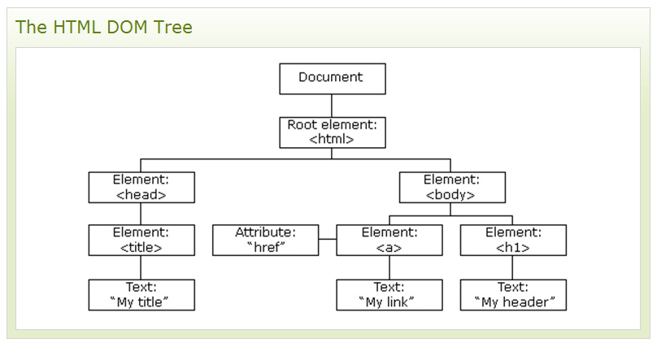

# CH04. 제이쿼리의 탐색(Traversing)

<br> 

## 1. 제이쿼리의 탐색(Traversing)이란?

"이동"을 의미하는 jQuery 탐색은 HTML 요소를 다른 요소와의 관계를 기반으로 "찾기"(또는 선택)하는 데 사용됩니다. 하나의 선택으로 시작하여 원하는 요소에 도달 할 때까지 그 선택을 통해 이동할 수 있습니다.

아래 이미지는 HTML 페이지를 트리 (DOM 트리)로 나타낸 것입니다. 트리 (DOM 트리)를 이용해 jQuery 탐색을 사용하면 선택한 (현재) 요소부터 트리 (상위), 아래 (자손) 및 옆으로 (형제) 위로 쉽게 이동할 수 있습니다. 이 움직임을 DOM 트리를 가로 지르는 (traversing) 또는 이동 (move through)이라고 합니다.

<br> 



<br> 
<br> 

## 2. 탐색(Traversing) 관련 메서드

- `$('대상').parent()` - 선택된 요소의 직접적인 부모 요소를 반환합니다.
- `$('대상').parents()` - 선택한 요소의 모든 상위 요소를 문서의 루트 요소까지 반환합니다.
- `$('대상').parents('selector')` - 선택적 매개 변수를 사용하여 조상에 대한 검색을 필터링 할 수도 있습니다.
- `$('대상').parentsUntil('selector')` - 주어진 두 인수 사이에 모든 조상 요소를 반환합니다.
- `$('대상').children()` - 선택된 요소의 모든 직접 자식을 반환합니다.
- `$('대상').find('selector')` - 선택한 요소의 자손 요소를 마지막 자손까지 반환합니다.
- `$('대상').siblings()` - 선택한 요소의 모든 형제 요소를 반환합니다.
- `$('대상').next()` - 선택한 요소의 다음 형제 요소를 반환합니다.
- `$('대상').prev()` - 선택한 요소의 이전 형제 요소를 반환합니다.
- `$('대상').first()` - 지정된 요소의 첫 번째 요소를 반환합니다.
- `$('대상').last()` - 지정된 요소의 마지막 요소를 반환합니다.
- `$('대상').eq(index)` - 선택된 요소의 특정 인덱스 번호를 가진 요소를 반환합니다.
- `$('대상').filter("selector")` - 선택된 요소와 일치하는 요소만 반환합니다.
- `$('대상').not("selector")` - 선택된 요소와 일치하지 않는 요소만 반환합니다.

<br> 
<br> 

#### [샘플 코드] - [샘플보기](http://wdschools.co.kr/gate/classroom/chapter4-jquery/page/sample/traversing/sample.html)

- HTML

```
<!DOCTYPE html>
<html lang="en">
<head>
  <meta charset="UTF-8">
  <meta http-equiv="X-UA-Compatible" content="IE=edge">
  <meta name="viewport" content="width=device-width, initial-scale=1.0">
  <title>탐색(Traversing)</title>
</head>
<body>
  
  <div id="student">
    <div>17</div>
    <div></div>
  </div>

  <script src="js/jquery-2.2.4.min.js"></script>

  <script>
    $(function(){

      // 대상 지정하기
      let student = $('#student');

      // 하고 싶은 일
      // 1. 나이 바꾸기 - $('대상').text();
      student.children().first().css('margin', '30px 0').text('23');
      
      // 2. 이미지 바꾸기 - $('대상').attr();
      student.find('img').attr({
        'src' : 'images/img2.jpg',
        'alt' : 'Photo2'
      });

    });
  </script>

</body>
</html>
```

  

##